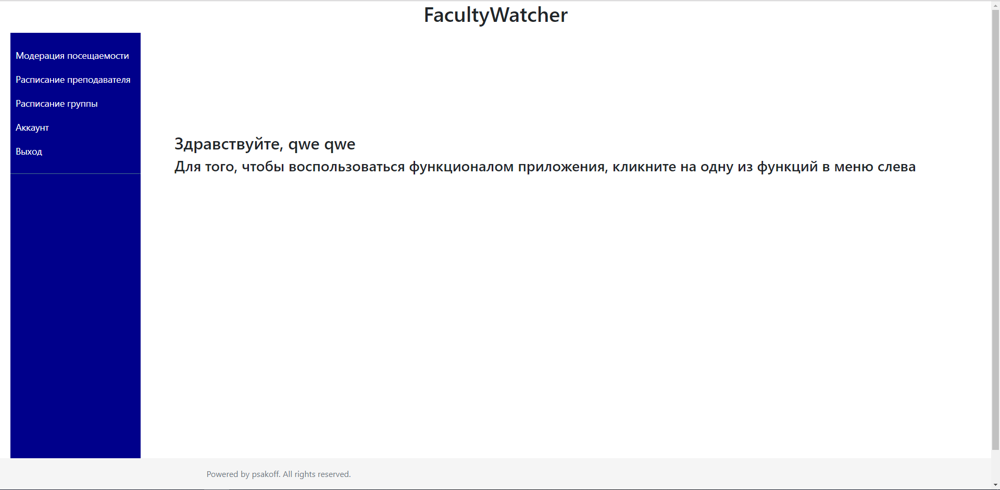

FacultyWatcher is the app for schedule viewing and attendance moderating. Administrator can register new users and lessons, teachers can moderate students' attendances, and students can view timetables and their attendances.
Frontend - Angular2/TS + ngx-bootstrap,
Backend - Java/Spring,
DB - Spring Data + MySQL,
login page

 teacher page

 student Page

 admin page

 attendance mod form 

 timetable form                                                                   

 save lesson form 

 save student form 

